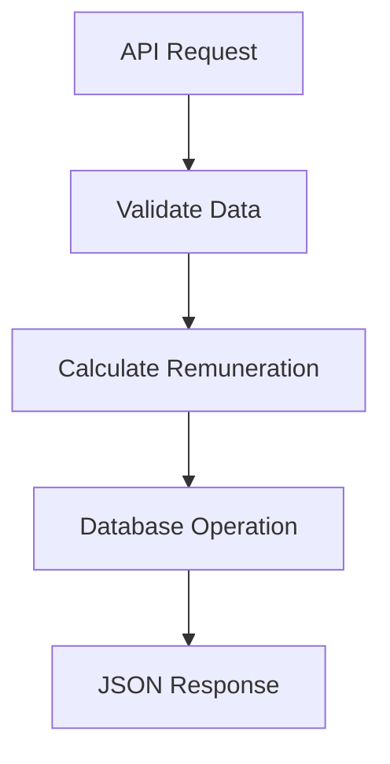

# Employee Task & Remuneration Tracker

This application allows employees to record their completed tasks and automatically calculates their remuneration based on the hours worked, hourly rate, and any additional charges.

---

## 📊 Architecture Overview

### System Components
1. **Frontend (Next.js)**
   - React-based UI with pages for:
     - Task listing
     - Task creation/editing
     - Remuneration calculation preview
   - State management (Context API/Redux)
   - Axios for API communication

2. **Backend (Laravel)**
   - RESTful API endpoints
   - Eloquent ORM for database operations
   - Prorated remuneration calculator
   - Request validation

3. **Database**
   - MySQL/PostgreSQL
   - Tables:
     - `tasks` (core table)
     - `employees` (optional for user auth)

### Detailed Data Flow

1. **API Request**  
   Next.js sends HTTP request to Laravel

2. **Validate Data**  
   Laravel checks input format and values

3. **Calculate Remuneration**  
   Prorated calculation happens here

4. **Database Operation**  
   Records are saved/updated

5. **JSON Response**  
   Laravel returns results to Next.js