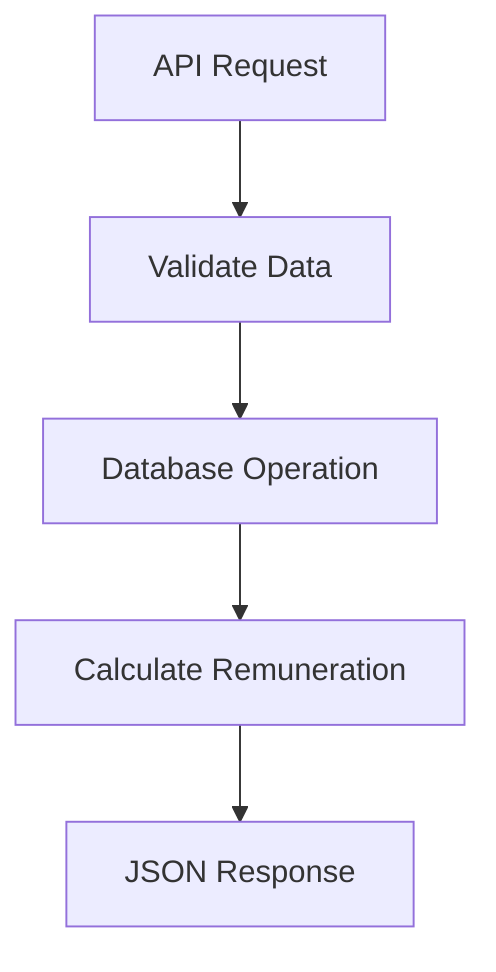

# Record Tugas & Remunerasi Pegawai

Aplikasi ini memungkinkan pegawai untuk mencatat tugas yang telah diselesaikan dan secara otomatis menghitung remunerasi mereka berdasarkan jam kerja, tarif per jam, dan biaya tambahan.

---

## Arsitektur Solusi

### Komponen Sistem

1. **Frontend (Next.js)**
   - UI berbasis React dengan halaman untuk:
     - Melihat Daftar Karyawan
     - Input Data Karyawan
     - Perhitungan remunerasi
   - Axios untuk komunikasi API

2. **Backend (Laravel)**
   - Endpoint API RESTful
   - Eloquent ORM untuk operasi database
   - Validasi request

3. **Database**
   - MySQL
   - Tables:
     - `tasks`

### Alur Data Secara Detail

1. **API Request**  
   Next.js mengirimkan permintaan HTTP ke Laravel

2. **Validate Data**  
   Laravel memeriksa format dan nilai input

3. **Database Operation**  
   Data disimpan/diperbarui

4. **JSON Response**  
   Laravel mengembalikan hasil output ke Next.js

5. **Menghitung remunerasi**
   Perhitungan dilakukan dan rumusnya ditampilkan menjadi satu table

---

## Penjelasan Desain

1. **Mengapa harus laravel?**
   Menurut saya laravel dapat mengelola API dengan cepat, lalu untuk menyusun routing dan database yang tidak begitu rumit. Seperti contohnya laravcel memiliki fitur seperti Eloquent ORM yang memungkinkan Anda untuk berinteraksi dengan database menggunakan syntax PHP bukan menggunakan query SQL secara langsung 

2. **Mengapa menggunakan NextJS?**
   Untuk Next.js sendiri sangat cocok untuk aplikasi yang memerlukan performa tinggi, misalnya dengan server-side rendering (SSR) atau static site generation (SSG) yang bisa mempercepat waktu load aplikasi. Fitur API Routes di Next.js juga memudahkan Anda dalam membuat komunikasi antara frontend dan backend tanpa membutuhkan framework tambahan. Dan mengapa saya melakukan perhitungan remunerasi dibagian depan karna mempermudah dalam pembuatan aplikasi ini, menurut saya tidak perlu terlalu secure karna untuk data rawnya sudah secure di bagian belakang, dan untuk mengimplementasikannya jadi lebih mudah karna tidak perlu susah payah mengelola dibagian belakang dan nantinya akan diolah lagi dibagian depan.

3. **Perhitungan remunerasi menggunakan sistem prorata**
   Untuk perhitungan remunerasi ini sendiri saya masih awam, jujur saya beberapa kali searching untuk hal ini dan yang mungkin saya pahami adalah sistem prorata ini saja, yaitu untuk memastikan remunerasi dibagi berdasakan kontribusi masing masing pegawai. Pendekatan tersebut adalah pendekatan yang cukup adil dan transparant untuk yang lainnya, apalagi dengan melibatkan lebih dari satu pegawai dalam satu pekerjaan yang sama

---

## Setup & Deploy

### Requirements

PHP:
   - PHP 8.2.12

Laravel:
   - Laravel Framework 12.13.0

Node:
   - v22.12.0

NextJS:
   - Next.js v15.3.2

Download repository

1. Buka frontend directory dan install depedensi yang dibutuhkan menggunakan npm

`cd frontend`

`npm i`

2. Buka backend directory dan install depedensi PHP yang dibutuhkan menggunakan composer

`cd ../backend`

`composer install`

3. Rename .env.example menjadi .env

4. Generate APP_KEY untuk aplikasi baru Laravel. ini akan setup env file juga nantinya.

`php artisan key:generate`

5. Migrasi databasenya untuk membuat table yang diperlukan.

`php artisan migrate`

### Load Data Dummy (tasks.sql) (jika dibutuhkan) ke dalam table yang baru saja di migrate

6. jalankan backend secara lokal

`php artisan serve`

7. jalankan frontend secara lokal

`npm run dev`

## Tantangan dan solusi

Saya merasa satu satunya tantangan adalah mengerjakannya dalam 3 hari, menurut saya itu adalah waktu yang cukup singkat. Walaupun sebenernya saya kurang yakin, namun begitu dikerjakan dalam kurun waktu kurang dari 3 hari dengan me-manage waktu dengan pekerjaan saya yang sekarang alhamdulillah saya dapat menyelesaikannya dengan hasil yang cukup memuaskan.
Untuk solusinya cukup bagaimana saya me-manage waktu dengan sebaik baiknya. Karna coding adalah hobi saya dan saya sangat tertarik dengan dunia web development. Semoga dengan challenge ini saya dapat berkontribusi dan diterima dalam perusahaan ibu/bapak. Terima kasih.