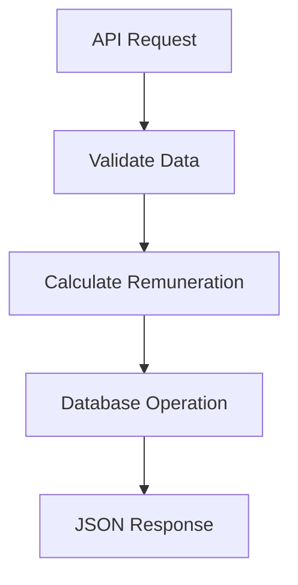

# Employee Task & Remuneration Tracker

This application allows employees to record their completed tasks and automatically calculates their remuneration based on the hours worked, hourly rate, and any additional charges.

---

## Architecture Overview

### System Components

1. **Frontend (Next.js)**
   - React-based UI with pages for:
     - Task listing
     - Task creation/editing
     - Remuneration calculation preview
   - State management (Context API/Redux)
   - Axios for API communication

2. **Backend (Laravel)**
   - RESTful API endpoints
   - Eloquent ORM for database operations
   - Prorated remuneration calculator
   - Request validation

3. **Database**
   - MySQL
   - Tables:
     - `tasks`

### Detailed Data Flow

1. **API Request**  
   Next.js sends HTTP request to Laravel

2. **Validate Data**  
   Laravel checks input format and values

3. **Calculate Remuneration**  
   Prorated calculation happens here

4. **Database Operation**  
   Records are saved/updated

5. **JSON Response**  
   Laravel returns results to Next.js

---

## Setup & Deploy

### Requirements

PHP:
   - PHP 8.2.12

Laravel:
   - Laravel Framework 12.13.0

Node:
   - v22.12.0

NextJS:
   - Next.js v15.3.2

Download repository

Navigate to the frontend directory and install the necessary dependencies using npm

`cd frontend`

`npm i`

Navigate to the backend (Laravel) directory and install the necessary PHP dependencies using composer

`cd ../backend`

`composer install`

Generate a new application encryption key for Laravel. This will set the APP_KEY in your .env file

`artisan key:generate`

Migrate the database to create the necessary tables. Make sure the database connection is properly set up in your .env file before running this.

`php artisan migrate`

Start frontend locally

`npm run dev`

Start backend local

`php artisan serve`
